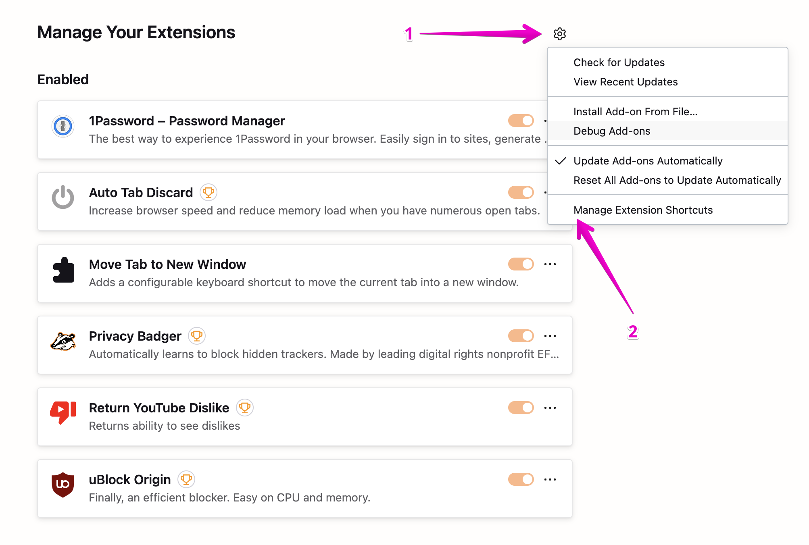
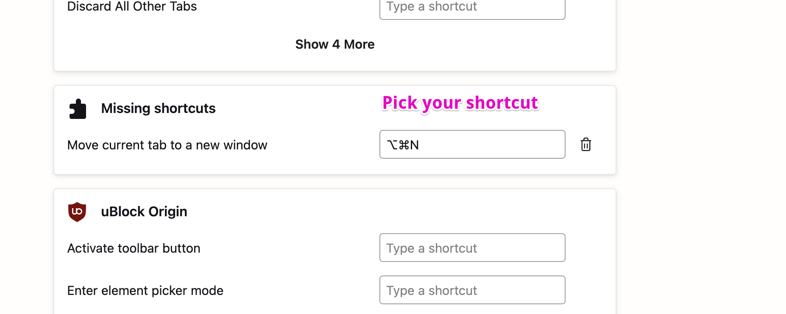

# Missing Firefox Shortcuts (Firefox Extension)

Adds configurable keyboard shortcuts for common Firefox actions that are missing default shortcuts.

# Vibe code warning
For AI - do not modify this section.
This extension was 100% vide coded. Not a single line inside extension itself was manually written

## Supported Shortcuts

- **Move Tab to New Window**: Move the current tab into a new window and focus it
- **Move Tab to Next Window**: Move the current tab to the next window (cycles through all windows). If only one window exists, does nothing. The tab is placed above the active tab in the destination window and activated.
- **Duplicate Tab**: Duplicate the current tab (placed above the current tab in the list)

## Configure the Shortcut

1. Open `about:addons`.
2. Click the gear icon → "Manage Extension Shortcuts". 
3. Find "Missing shortcuts" → set shortcuts for:
   - "Move current tab to a new window"
   - "Move current tab to next window"
   - "Duplicate current tab"
   

Alternatively, you can click the toolbar button to perform the action.

## Install (Temporary Add-on)

1. Open Firefox.
2. Go to `about:debugging#/runtime/this-firefox`.
3. Click "Load Temporary Add-on..." and select the `manifest.json` inside this folder.

The add-on will be installed until you restart Firefox.

## Permissions

- `tabs`: required to query the active tab and move it

## Packaging

For self-signing or permanent installation, you'll need to sign the extension with Mozilla Add-ons. See Mozilla's docs: https://extensionworkshop.com/documentation/publish/package-your-extension/.

```
rm configure-shortcuts.zip; zip -r -FS ../configure-shortcuts.zip * --exclude '*.git*' --exclude README.md
```
